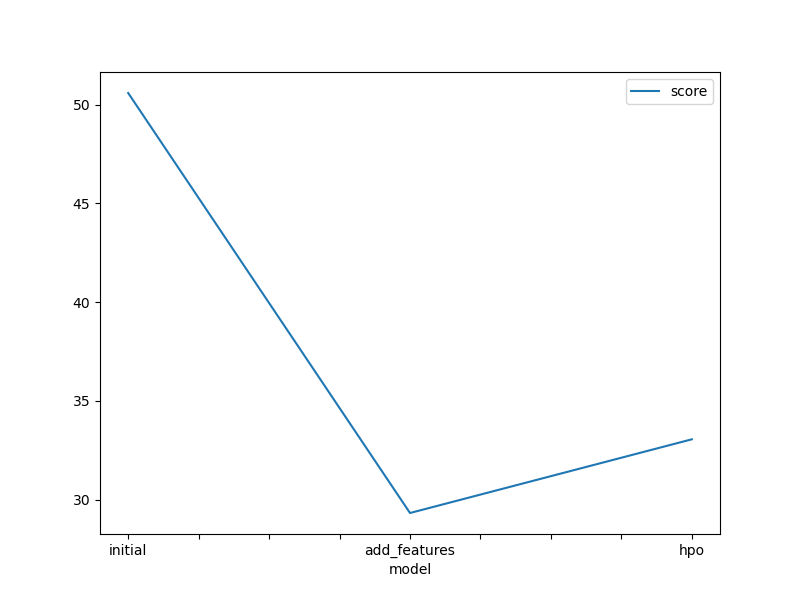
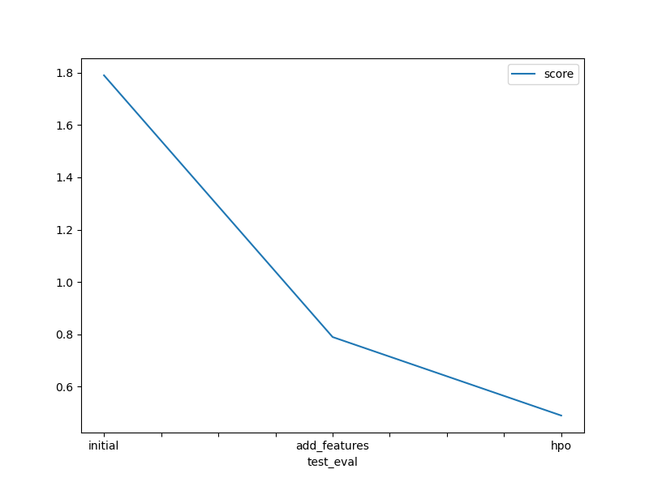

# Report: Predict Bike Sharing Demand with AutoGluon Solution

#### Sally Wright

## Initial Training

### What did you realize when you tried to submit your predictions? What changes were needed to the output of the predictor to submit your results?

Kaggle will not accept any negative predictions so these need to be set to 0. Also as I was running the notebook in a local environment on a Mac, LightGBM_BAG_L1, LightGBMLarge_BAG_L1, LightGBMXT_BAG_L2,LightGBM_BAG_L2, LightGBMLarge_BAG_L2 were not running due to enviroment set up and not being able to find libomp

### What was the top ranked model that performed?

WeightedEnsemble_L3

## Exploratory data analysis and feature creation

### What did the exploratory analysis find and how did you add additional features?

Holiday and workingday werent evenly distributed, could be an area that could have data added. The season is evenly distributed and the temp, humidity and windspeed have normal distribution. There doesnt look to be any outliers to skew the data. The date was split into time/day/month to get a better understanding of demand over certain days of the week/weeks and its influence on the models accuracy.

### How much better did your model preform after adding additional features and why do you think that is?

Quite a big improvement when time was split up into days, weeks, hours and years. This improved the model performance because these predictors allow the model to assess the patterns in the date more effectively. The Kaggle score went from 1.84 to 0.79 which is a 57.1% increase in accuracy.

## Hyper parameter tuning

### How much better did your model preform after trying different hyper parameters?

1. First off I used the models that didnt have enough time to run in the first two model fitting sessions with nothing specific in the parameters.
   {'CAT':{},'NN_TORCH': {},'FASTAI':{},'XGB':{}}, the neural networks tended to stop due to time constraints so I put a limit of 10 epochs on them. As Catboost still wasnt finishing I ran this by itself as a parameter 'CAT':{} and got
   CatBoost_BAG_L1 -33.023490
   WeightedEnsemble_L2 -33.023490
   CatBoost_BAG_L2 -33.244852
   WeightedEnsemble_L3 -33.244852

2. After a bit of research I started with these paramaters to play with
   nn_params = {'num_epochs': 10, 'learning_rate': 0.001, 'activation': 'relu', 'dropout_prob': 0.1}

cat_params = {'iterations': 1000, 'learning_rate': 0.1, 'random_seed': 0, 'use_best_model': True, 'depth': 6}
rf_params = {'n_estimators': 100, 'max_depth': 10, 'min_samples_split': 2, 'min_samples_leaf': 1, 'max_features': 'sqrt', 'bootstrap': True}

This gave me a best score of WeightedEnsemble_L3 -34.362456

I changed the n_estimators for rf_params and the learning_rate for cat_params of which yielded worse results. As well as using 'sigmoid' for the NN_torch activation. So none of the above paramters improved the model.

I then went back to the original parameters and added hyperparameter_tune_kwargs resulting in the following model.

```hyperparameters = {'CAT':{},'NN_TORCH': {},'FASTAI':{},'XGB':{}}
hyperparameter_tune_kwargs = {
    'num_trials': 5,
    'scheduler' : 'local',
    'searcher': 'auto',
}

predictor_new_hpo1 = TabularPredictor(label=label, path="bike_sharing",eval_metric=eval_metric).fit(cleandf,  presets="best_quality",hyperparameters=hyperparameters,time_limit=time_limit, hyperparameter_tune_kwargs=hyperparameter_tune_kwargs)
```

This improved the kaggle score from 0.79 to 0.48 which is a 39.2% increase in accuracy from just adding the feautures and 73.91% increase in accuracy from the initial model.

### If you were given more time with this dataset, where do you think you would spend more time?

Explore the neural networks. Devle into the features more as this seemed to have the most impact on the result. Look at holidays and time of bike use on work days and other days. Try and find a solution to the error that prevented the LightGBM_BAG_L1, LightGBMLarge_BAG_L1, LightGBMXT_BAG_L2,LightGBM_BAG_L2, LightGBMLarge_BAG_L2 models from running. Do more research into available hyperparameters.

### Create a table with the models you ran, the hyperparameters modified, and the kaggle score.

| model        | Time Limit | Presets                               | Parameters Modified                                                                                                  | Kaggle score |
| ------------ | ---------- | ------------------------------------- | -------------------------------------------------------------------------------------------------------------------- | ------------ |
| initial      | 600        | Best Quality, root mean squared error | None                                                                                                                 | 1.84         |
| add_features | 600        | Best Quality, root mean squared error | hour/day/month/year/dayofweek                                                                                        | 0.79         |
| hpo          | 600        | Best Quality, root mean squared error | 'CAT':{},'NN_TORCH': {},'FASTAI':{},'XGB':{}, hyper-kwarks 'num_trials': 5,'scheduler' : 'local','searcher': 'auto', | 0.48         |

### Create a line plot showing the top model score for the three (or more) training runs during the project.



### Create a line plot showing the top kaggle score for the three (or more) prediction submissions during the project.



## Summary

It appears that the best model is the WeightedEnsemble_L3. But this doesnt include any of the models LightGBM_BAG_L1, LightGBMLarge_BAG_L1, LightGBMXT_BAG_L2,LightGBM_BAG_L2, LightGBMLarge_BAG_L2. It will be interesting to add these results to the project. Splitting the date into hour,day, week and year seems to have had the most positive effect on the prediction. Tuning the hypermeters had a negative effect and performed worse than the model with just the features added. I managed to get the kaggle score down to 0.49 adding the hyperparameters but it would be interesting to further dive into the hyperparameters. The best model with the lowest error was actually the model where only the time features where adjusted, but the best kaggle score came from the model where the hyperparameters were tuned even though the error was higher.
